<div class="alert alert-warning">
⚠️ <b>Dec-2023:</b> Be aware that the functions `sim_songs()` has undergone substantial changes beginning with warbleR 1.1.30 which simulations may not those shown in this post.
</div>


This post shows how to simulate animal vocalizations using the new [warbleR](https://cran.r-project.org/package=warbleR) function `sim_songs`. The function allows users to create song with several sub-units and harmonics, which are return as a wave object in the `R` environment. This can have several applications, from simulating song evolution to testing the efficacy of methods to measure acoustic structure for different signal types. 

The function uses a brownian motion model of stochastic diffusion to simulate the changes in frequency (e.g. modulation) across continuous traces of sound (song sub-units or elements). Several parameters of the songs can be customized, which allow users to simulate an wide range of signal structures. Nonetheless, more parameters and diffusion models will be added in future versions.

First install and/or load [warbleR](https://cran.r-project.org/package=warbleR) developmental version (if there is an older [warbleR](https://cran.r-project.org/package=warbleR) version installed it has to be removed first):


```r
# remove warbleR
remove.packages("warbleR")

# install devtools if not installed
if (!"devtools" %in% installed.packages()[,"Package"])  
  install.packages("devtools")

# and install warbleR from github
devtools::install_github("maRce10/warbleR")
library("warbleR")
```


The basic song "parameters" that can be customized using the `sim_songs` function are: 

1. The number of sub-units
1. The number of harmonics
1. the carrier frequencies
1. The degree of frequency modulation
1. The duration of sub-units and silences in between

The following code simulates a "song" with 5 sub-units, with a starting frequency of 5 kHz and a single harmonic (fundamental): 


```r
# simulate song
sm_sng <- sim_songs(n = 5, harms = 1, freqs = 5, seed = 8)

#plot spectro
spectro(sm_sng, grid = FALSE, flim = c(0, 12), wl = 300, 
                    collevels = seq(-27, 0 , 1), 
        palette = reverse.topo.colors, scale = FALSE)
```

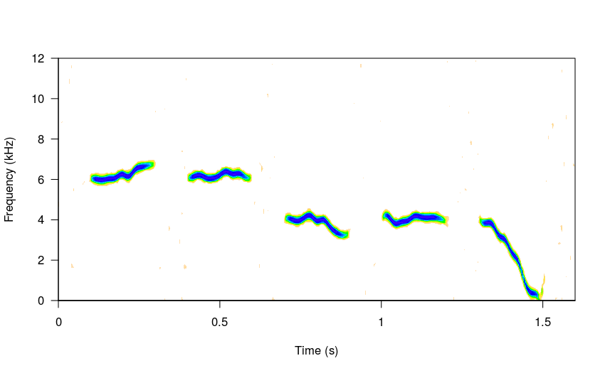

<font size="3"><i>* A seed is used so the same song will be generated every time. If `seed = NULL` (as by default) then a different song will produced each time</i></font>

Longer "repertoires" can be produced by simply increasing `n`:

```r
# 10 elements
sm_sng <- sim_songs(n = 10, harms = 1, freqs = 5, seed = 16, 
                    sig2 = 0.7, steps = 8)

#plot spectro
spectro(sm_sng, grid = FALSE, flim = c(0, 12), wl = 300, 
        collevels = seq(-27, 0 , 1), 
        palette = reverse.heat.colors, scale = FALSE)
```

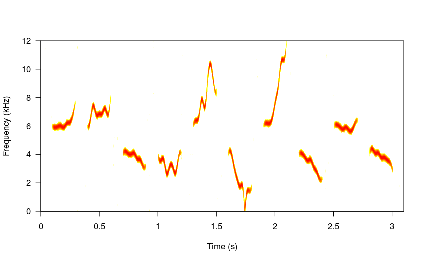

```r
# 15 elements
sm_sng <- sim_songs(n = 15, harms = 1, freqs = 5, seed = 37, steps = 10)

#plot spectro
spectro(sm_sng, grid = FALSE, flim = c(1, 12), wl = 300, 
        collevels = seq(-27, 0 , 1), 
        palette = reverse.terrain.colors, scale = FALSE)
```

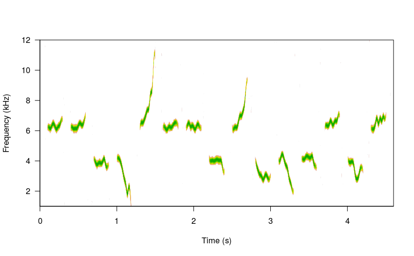
 
The amount of modulation can be controlled with the argument `sig2` (just as in the brownian model of evolution). Low values will produce little variation in the frequency slope:


```r
# low sigma
sm_sng <- sim_songs(n = 5, harms = 1, freqs = 5, seed = 8, sig2 = 0.1)

#plot spectro
spectro(sm_sng, grid = FALSE, flim = c(1, 12), wl = 300, 
        collevels = seq(-25, 0 , 1), 
        palette = reverse.topo.colors, scale = FALSE)
```

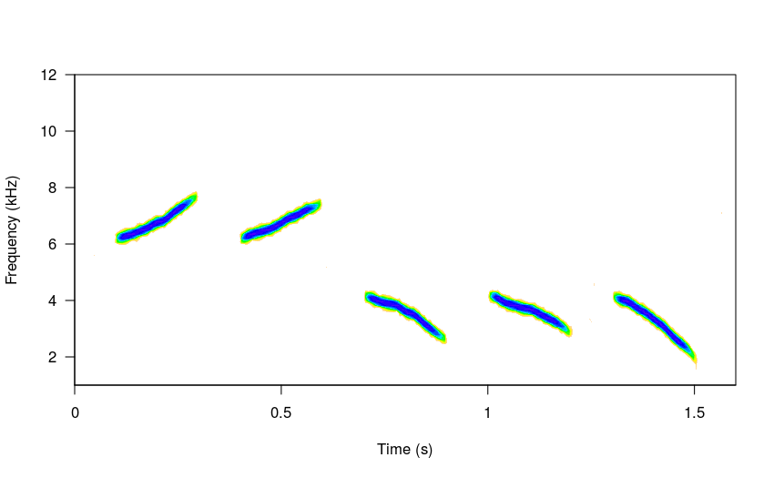

While higher `sig2` values will generate "faster" frequency changes:


```r
# high sigma
sm_sng <- sim_songs(n = 5, harms = 1, freqs = 5, seed = 8, sig2 = 0.9)

#plot spectro
spectro(sm_sng, grid = FALSE, flim = c(1, 12), 
        collevels = seq(-27, 0 , 1), 
        palette = reverse.terrain.colors, scale = FALSE)
```

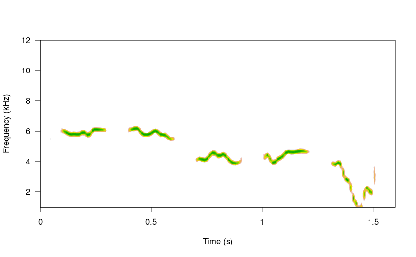


Harmonics can also be added to the songs by modifying the `harms` argument:


```r
# high sigma
sm_sng <- sim_songs(n = 5, harms = 3, freqs = 5, seed = 8, sig2 = 0.9)

#plot spectro
spectro(sm_sng, grid = FALSE, flim = c(1, 12), 
        collevels = seq(-27, 0 , 1), 
        palette = reverse.terrain.colors, scale = FALSE)
```

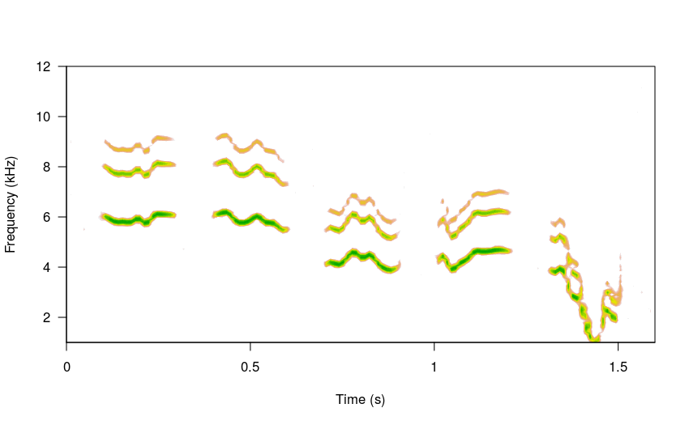

The `steps` argument allows to define the length of the time series generated by the underlying brownian motion function. This time series is simply the frequency values at each time window (after some spline smoothing) of the song elements. Lower `steps` values will produce less modulated songs (other things equal):

```r
# high sigma
sm_sng <- sim_songs(n = 5, harms = 3, freqs = 5, seed = 8, 
                    sig2 = 0.9, steps = 4)

#plot spectro
spectro(sm_sng, grid = FALSE, flim = c(1, 12), 
        collevels = seq(-27, 0 , 1), 
        palette = reverse.terrain.colors, scale = FALSE)
```

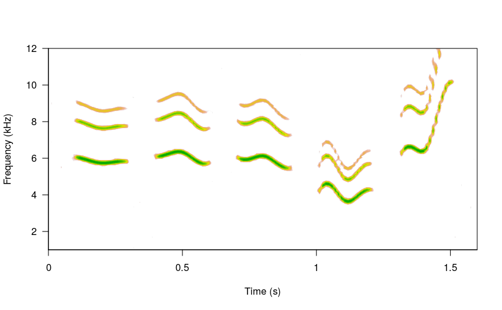

Higher `steps` values will increase modulation:

```r
# high sigma
sm_sng <- sim_songs(n = 5, harms = 3, freqs = 5, seed = 8, 
                    sig2 = 0.9, steps = 70)

#plot spectro
spectro(sm_sng, grid = FALSE, flim = c(1, 12), 
        collevels = seq(-27, 0 , 1), 
        palette = reverse.terrain.colors, scale = FALSE)
```

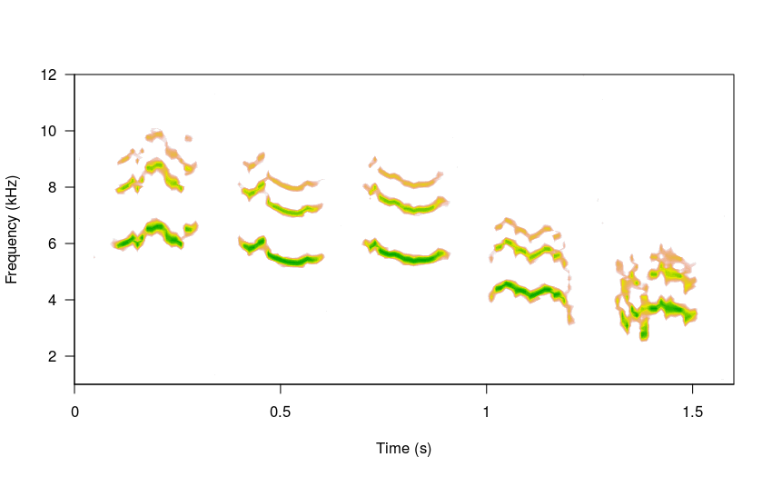


The duration of the sub-units and gaps between elements can also be specified for each of the items:


```r
durs <- seq(0.5, 0.1, length.out = 5) 
gaps <- c(0.2, 0.15, 0.1, 0.08, 0.05, 0.2)

# high sigma
sm_sng <- sim_songs(n = 5, harms = 3, freqs = 5, seed = 84, sig2 = 0.1, 
                    steps = 20, durs = durs, gaps = gaps)

#plot spectro
spectro(sm_sng, grid = FALSE, flim = c(1, 12), 
        collevels = seq(-27, 0 , 1), 
        palette = reverse.terrain.colors, scale = FALSE)
```

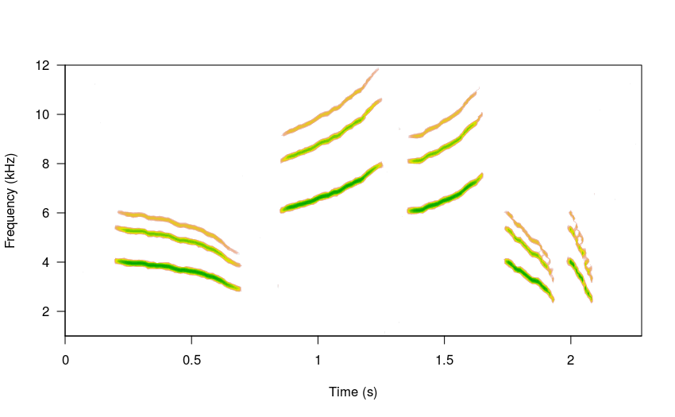

Users can also adjust the relative amplitude of the harmonics. The following code puts the highest energy on the second harmonic (e.g. the dominant frequency) using the `amps` argument:


```r
# high sigma
sm_sng <- sim_songs(n = 4, harms = 5, freqs = 5, seed = 24, 
                    amps = c(0.7, 1, 0.5, 0.3, 0.25))

#plot spectro
spectro(sm_sng, grid = FALSE, flim = c(1, 12), 
        collevels = seq(-23, 0 , 1), 
        palette = reverse.topo.colors, scale = FALSE)
```

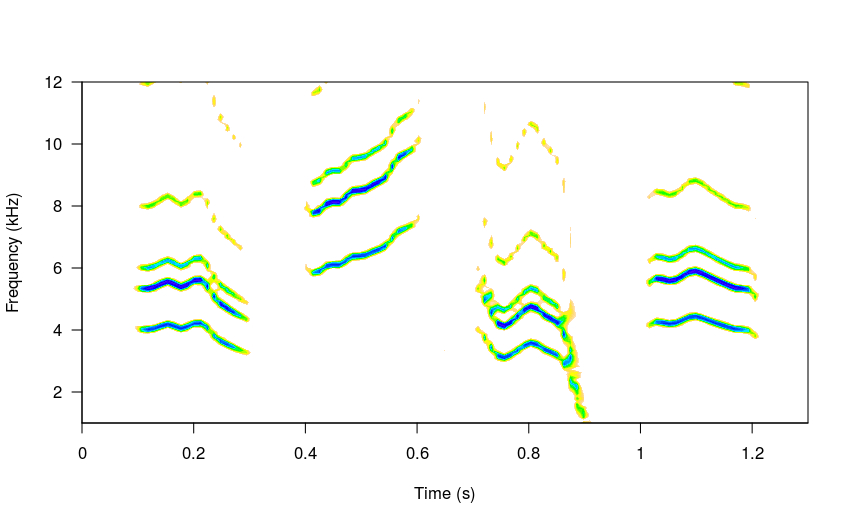

The simulated song can be played with the `play` function from [tuneR](https://cran.r-project.org/package=tuneR) or by saving the wave file and opening it in a regular audio player. Here is an example of a 20 element simulated song:


```r
#set variable durations 
durs <- rnorm(n = 20, mean = 0.21, sd = 0.05)

#and variable gaps
gaps <- rnorm(n = 21, mean = 0.12, sd = 0.06)

# and frequencies
freqs <- rnorm(n = 20, mean = 3, sd = 0.7)

# high sigma
sm_sng <- sim_songs(n = 20, harms = 3, seed = 25, 
                    durs = durs, gaps = gaps, steps = 4, 
                    freqs = freqs, diff_fun = "BB")

#plot spectro
spectro(sm_sng, grid = FALSE, flim = c(0, 9), 
        collevels = seq(-23, 0 , 1), 
        palette = reverse.topo.colors, scale = FALSE)
```

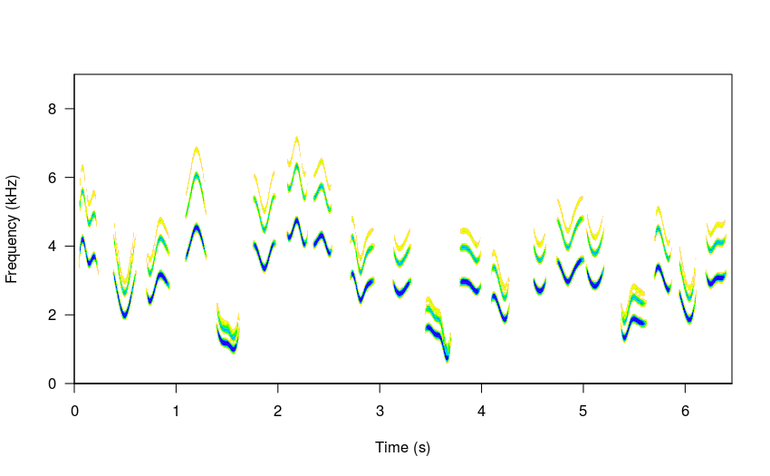


```r
# save it as a wave file
writeWave(sm_sng, "simulated_song.wav")
```

And this is how it sounds:

<audio controls style="width: 700px;">
   <source src="./img/simulated_song.mp3" type="audio/mpeg">
</audio>


In the above example the "BB" diffusion model was used to simulate the sounds (argument `diff_fun`). This method forces the sub-units to start and end at the same frequency. Note also that combining random variables to set durations and gaps can help create more realistic songs. 

Finally, the background noise level (argument `bgn`), sampling rate (`samp.rate`) amd amplitude fade-in (`fin`) and fade-out (`fout` & `shape`) can also be adjusted.

More options will be added in future versions. Suggestions are welcome. I am particularly interested on diffusion models (or any other algorithm) that can generate different types of signals, ideally even more similar to the ones found in nature.

Please report any bugs [here](https://github.com/maRce10/warbleR/issues). 


```
R version 3.4.4 (2018-03-15)
Platform: x86_64-pc-linux-gnu (64-bit)
Running under: Ubuntu 16.04.5 LTS

Matrix products: default
BLAS: /usr/lib/openblas-base/libblas.so.3
LAPACK: /usr/lib/libopenblasp-r0.2.18.so

locale:
 [1] LC_CTYPE=en_US.UTF-8       LC_NUMERIC=C               LC_TIME=en_US.UTF-8        LC_COLLATE=en_US.UTF-8    
 [5] LC_MONETARY=en_US.UTF-8    LC_MESSAGES=en_US.UTF-8    LC_PAPER=en_US.UTF-8       LC_NAME=C                 
 [9] LC_ADDRESS=C               LC_TELEPHONE=C             LC_MEASUREMENT=en_US.UTF-8 LC_IDENTIFICATION=C       

attached base packages:
[1] stats     graphics  grDevices utils     datasets  methods   base     

other attached packages:
[1] ggplot2_3.0.0        microbenchmark_1.4-4 kableExtra_0.9.0     knitr_1.20           warbleR_1.1.15      
[6] NatureSounds_1.0.0   seewave_2.1.0        tuneR_1.3.3          maps_3.3.0          

loaded via a namespace (and not attached):
 [1] rgl_0.95.1441        Rcpp_0.12.18         fftw_1.0-4           assertthat_0.2.0     rprojroot_1.3-2     
 [6] digest_0.6.16        R6_2.2.2             plyr_1.8.4           Sim.DiffProc_4.1     backports_1.1.2     
[11] signal_0.7-6         evaluate_0.11        pracma_2.1.5         httr_1.3.1           highr_0.7           
[16] pillar_1.3.0         rlang_0.2.2          lazyeval_0.2.1       curl_3.2             rstudioapi_0.7      
[21] rmarkdown_1.10       devtools_1.13.6      moments_0.14         readr_1.1.1          stringr_1.3.1       
[26] RCurl_1.95-4.11      munsell_0.5.0        proxy_0.4-22         compiler_3.4.4       Deriv_3.8.5         
[31] pkgconfig_2.0.2      htmltools_0.3.6      tidyselect_0.2.4     tibble_1.4.2         dtw_1.20-1          
[36] bioacoustics_0.1.5   viridisLite_0.3.0    crayon_1.3.4         dplyr_0.7.6          withr_2.1.2         
[41] MASS_7.3-50          bitops_1.0-6         grid_3.4.4           gtable_0.2.0         git2r_0.23.0        
[46] magrittr_1.5         scales_1.0.0         stringi_1.2.4        pbapply_1.3-4        scatterplot3d_0.3-41
[51] bindrcpp_0.2.2       xml2_1.2.0           rjson_0.2.20         iterators_1.0.10     tools_3.4.4         
[56] glue_1.3.0           purrr_0.2.5          hms_0.4.2            jpeg_0.1-8           parallel_3.4.4      
[61] yaml_2.2.0           colorspace_1.3-2     soundgen_1.3.1       rvest_0.3.2          memoise_1.1.0       
[66] bindr_0.1.1         
```
