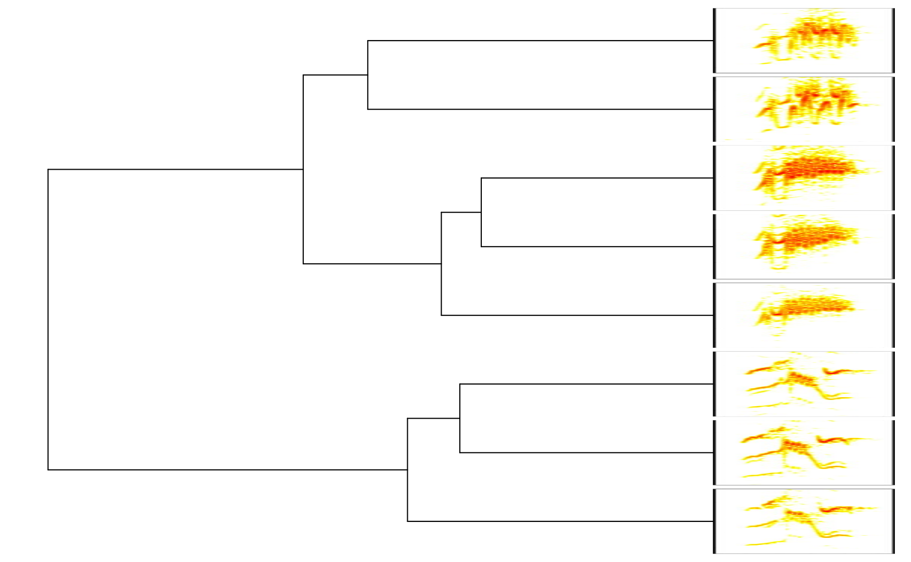

This post describes the new [warbleR](https://cran.r-project.org/package=warbleR) function [phylo_spectro](https://marce10.github.io/warbleR/reference/phylo_spectro.html). The function adds spectrograms of sounds annotated in a selection table ('X argument) onto the tips of a tree (of class 'phylo'). The 'tip.label' column in 'X' is used to match spectrograms and tree tips. The function uses internally the [plot.phylo](https://www.rdocumentation.org/packages/ape/versions/5.2/topics/plot.phylo) function from the ape package to plot the tree and [warbleR's](https://cran.r-project.org/package=warbleR)  [specreator](https://marce10.github.io/warbleR/reference/specreator.html) function to create the spectrograms. Arguments for both of these functions can be provided for further customization. 
 
We'll first load the example data set from [warbleR](https://cran.r-project.org/package=warbleR) as well as the [ape package](https://cran.r-project.org/package=ape). 


```r
# load warbleR and ape
library(warbleR)
library(ape)

#load data and save sound files
data(list = c("Phae.long1", "Phae.long2", "Phae.long3", "lbh_selec_table"))
writeWave(Phae.long1,"Phae.long1.wav")
writeWave(Phae.long2,"Phae.long2.wav")
writeWave(Phae.long3,"Phae.long3.wav")

# set warbleR global options
# this options can also be set within the function call
warbleR_options(wl = 300, pb = FALSE, ovlp = 95, flim = "frange", 
                pal = reverse.heat.colors, parallel = 3)
```

The tricky part is that the selection table must contain a column named 'tip.label' that matches the tip labels in the tree. The following code calculates pairwise cross-correlations and creates a tree that clusters songs based on cross-correlation dissimilarities (1 - XC scores).
 

```r
# extract the first 8 rows in the example data
X <- lbh_selec_table[1:8, ]

# add tip.label column
X$tip.label <- paste0(X$sound.files, "-", X$selec)

# run cross correlation
xc <- xcorr(X)

# create a hierarchical cluster
xc.tree <- hclust(d = as.dist(1 - xc))

# convert h clust to phylogenetic tree
xc.tree <- as.phylo(xc.tree)

# plot tree with spectrograms
phylo_spectro(X = X, tree = xc.tree, offset = 0, par.mar = c(1, 1, 1, 8),
inner.mar = rep(0, 4), size = 1, xl = 0.1, show.tip.label = FALSE, 
res = 300)
```



It can also plot fan trees by setting `type = "fan"`:


```r
# plot fan tree with spectrograms
phylo_spectro(X = X, tree = xc.tree, offset = 0.12, par.mar = rep(5, 4),
inner.mar = rep(0, 4), size = 2, type = "fan", show.tip.label = FALSE, 
res = 300)
```


Additional arguments can be passed to [plot.phylo](https://www.rdocumentation.org/packages/ape/versions/5.2/topics/plot.phylo). Here we modify 'edge.lty' and 'edge.witdth':


```r
# plot tree with spectrograms
phylo_spectro(X = X, tree = xc.tree, offset = 0.12, par.mar = rep(5, 4),
inner.mar = rep(0, 4), size = 2, type = "fan", show.tip.label = FALSE, 
res = 300, edge.color = "red", edge.lty = 4, edge.width = 4)
```


and to [specreator](https://marce10.github.io/warbleR/reference/specreator.html). Here we modify 'pal' (color palette):


```r
# plot tree with spectrograms
phylo_spectro(X = X, tree = xc.tree, offset = 0.12, par.mar = rep(5, 4),
inner.mar = rep(0, 4), size = 2, type = "fan", show.tip.label = FALSE,
pal = reverse.topo.colors, res = 300)
```


Here is another example using an [extended selection table](https://marce10.github.io/bioacoustics_in_R/2018/05/15/Extended_selection_tables.html) and more signals:


```r
data("Phae.long.est")

# get songs belonging to 4 different song types
X <- Phae.long.est[c(1:5, 11:15, 21:25, 31:35), ]

# add tip.label column
X$tip.label <- paste0(X$sound.files, "-", X$selec)

# run cross correlation
xc <- xcorr(X)

# create a hierarchical cluster
xc.tree <- hclust(d = as.dist(1 - xc))

# convert h clust to phylogenetic tree
xc.tree <- as.phylo(xc.tree)

# plot fan tree with spectrograms
phylo_spectro(X = X, tree = xc.tree, offset = 0.02, par.mar = rep(2, 4),
inner.mar = rep(0, 4), size = 2.3, type = "fan", res = 300,
show.tip.label = FALSE, pal = reverse.gray.colors.1, 
flim = c(2, 10), edge.color = "orange",  edge.width = 3)
```


Of course, the function can also plot species songs on phylogenetic trees. Here is an example from an ongoing project:


That's it! Special thanks to [Gerardo Soto](https://www.researchgate.net/profile/Gerardo_Soto2) and [Russel Ligon](http://russellligon.wixsite.com/russell-ligon) for suggestions on how to make this function work.

<font size="4">Session information</font>


```
## R version 3.5.1 (2018-07-02)
## Platform: x86_64-pc-linux-gnu (64-bit)
## Running under: Ubuntu 18.10
## 
## Matrix products: default
## BLAS: /usr/lib/x86_64-linux-gnu/openblas/libblas.so.3
## LAPACK: /usr/lib/x86_64-linux-gnu/libopenblasp-r0.3.3.so
## 
## locale:
##  [1] LC_CTYPE=en_US.UTF-8       LC_NUMERIC=C              
##  [3] LC_TIME=en_US.UTF-8        LC_COLLATE=en_US.UTF-8    
##  [5] LC_MONETARY=en_US.UTF-8    LC_MESSAGES=en_US.UTF-8   
##  [7] LC_PAPER=en_US.UTF-8       LC_NAME=C                 
##  [9] LC_ADDRESS=C               LC_TELEPHONE=C            
## [11] LC_MEASUREMENT=en_US.UTF-8 LC_IDENTIFICATION=C       
## 
## attached base packages:
## [1] stats     graphics  grDevices utils     datasets  methods   base     
## 
## other attached packages:
## [1] ape_5.2            warbleR_1.1.16     NatureSounds_1.0.1
## [4] seewave_2.1.0      tuneR_1.3.3        maps_3.3.0        
## 
## loaded via a namespace (and not attached):
##  [1] Rcpp_1.0.0       knitr_1.20       magrittr_1.5     Sim.DiffProc_4.3
##  [5] MASS_7.3-50      lattice_0.20-35  Deriv_3.8.5      rjson_0.2.20    
##  [9] jpeg_0.1-8       pbapply_1.3-4    highr_0.7        stringr_1.3.1   
## [13] tools_3.5.1      grid_3.5.1       parallel_3.5.1   nlme_3.1-137    
## [17] dtw_1.20-1       iterators_1.0.10 yaml_2.2.0       soundgen_1.3.2  
## [21] bitops_1.0-6     RCurl_1.95-4.11  signal_0.7-6     evaluate_0.12   
## [25] proxy_0.4-22     stringi_1.2.4    pracma_2.2.2     compiler_3.5.1  
## [29] fftw_1.0-4
```

